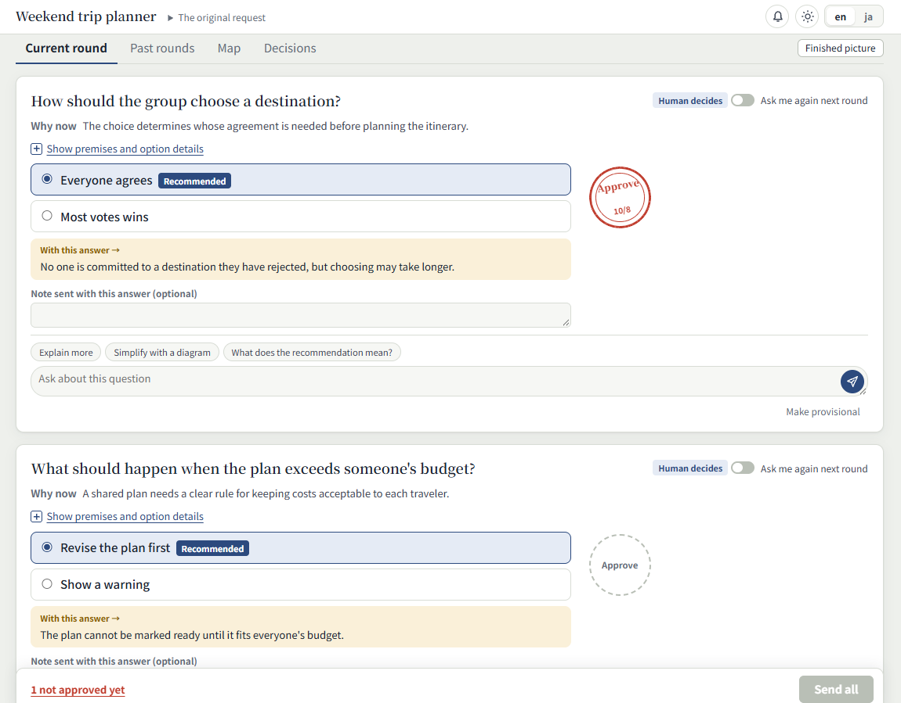

# shoryo

[English](README.md)

shoryo は、LLM との壁打ちで要件を詰めるためのツールです。
チャットではなく、ローカルのブラウザで問いと答えを扱います。
エージェントがラウンドごとに問いを出し、利用者が答えを確かめて送ります。
結果に合意したら、shoryo を呼び出したワークフローが仕様を書きます。



方針や振る舞いに関わる問いはカードで表示します。
答える前に、その問いについて LLM に質問できます。
答えを確かめたら判子を押し、ラウンド全体をまとめて送ります。
あとで安く変更できる問いは、仮決めとして別の一覧に表示します。
エージェントが推奨を入れ、本人に代わって判子を押しておきます。
送る前に答えを変えることもできます。
仮決めが決まったことになるのは、ラウンドを送ったときです。

地図では、問いと決まったことのつながりを見られます。
完成図では、議題の最終形を見られます。
過去のラウンド、返事、決まったことも読めます。
最新ラウンドが未送信なら、決まったことの見直しを頼めます。
壁打ちがまとまったら結果を確かめ、その後ワークフローが仕様を書きます。

shoryo は、バイナリとスキルの二つで構成されています。

- `shoryo` バイナリは議題ごとにローカルの Web サーバーを起動します。エージェントはコマンドでラウンドを出し、答えを待ち、質問に返事を送ります。画面のファイルもバイナリに含まれています。
- [shoryo スキル](skills/shoryo/SKILL.md)には、ラウンドの書き方、問いの仕分け、答えの扱い方を記述しています。

問いを選び、結果のデータから仕様を書くのは、shoryo を使う壁打ちワークフローです。
ブラウザからモデルの API を直接呼ぶわけではありません。
エージェントが CLI を通じて問い、答え、返事をやり取りします。

## インストール

### バイナリ

GitHub releases の Linux x86_64 向け静的バイナリを、[mise](https://mise.jdx.dev/) でインストールします。

```sh
mise use -g github:ba0918/shoryo
shoryo --version
```

Rust 1.99 以降でソースからインストールすることもできます。

```sh
cargo install --locked --git https://github.com/ba0918/shoryo
```

### エージェントのスキル

[GitHub CLI](https://cli.github.com/) でスキルをインストールします。
Claude Code で複数のプロジェクトから使う場合は、ユーザー単位でインストールしてください。

```sh
gh skill install ba0918/shoryo shoryo --agent claude-code --scope user
```

別のエージェントを使う場合は、`--agent` の値を変えてください。
対応するエージェントとインストールの選択肢は、`gh skill install --help` で確認できます。

## 使い方

エージェントに「shoryo で壁打ちして」と頼んでください。
エージェントが議題のサーバーを起動し、ブラウザで開く URL を伝えます。
サーバーは既定で `127.0.0.1` だけで待ち受けます。
`--bind` で別のアドレスを指定すると、画面を暗号化されていない HTTP で公開します。

ヘッダーでは、表示言語を英語と日本語で切り替えられます。
テーマはライト、ダーク、システムに合わせる設定から選べます。
設定は議題をまたいで適用されます。
Linux での既定の設定ファイルは `~/.config/shoryo/config.toml` です。

ヘッダーの「操作待ち」は、エージェントの `wait` コマンドが続いている間だけ表示します。
それ以外はエージェントの状態を表示しません。
この表示から、モデルが実際に動いているか、停止したかは分かりません。

ラウンドを送ると、フッターに何を待っているかを表示します。
答えや見直し依頼を送った後は、次のラウンドを待ちます。
結果を「この結果で進める」で送った後は、議題の終了を待ちます。
待ち表示はタブを切り替えても残り、再読込後も復元されます。
送信から 3 分たっても次のラウンドが届かないか議題が終わらない場合は、エージェント側を確認する案内を加えます。
この案内は、エージェントが停止したという意味ではありません。

表示範囲の外に新しいラウンドや返事が届くと、「見る」ボタン付きの通知を出します。
ヘッダーの通知アイコンは未読の件数を示します。
アイコンを押すと、最近届いたもの 10 件を一覧で確認できます。
通知が消えた後も、一覧から開けます。
「戻る」で、移動する前に見ていた場所へ戻れます。

議題のデータは、ユーザーごとのデータディレクトリに保存します。
リポジトリ内には保存しません。
Linux での既定の場所は `~/.local/share/shoryo/` です。
shoryo がデータを削除することはありません。
不要になった議題のディレクトリは、自分で削除してください。

### 説明形式の変更（0.1.1）

問いの前提知識（`background`）と選択肢の詳細説明（`description`）は、文章、コード、シーケンス図、フローチャート、既存図のパーツを読み順に並べた列で渡します。
返事も従来の `text` / `diagram` 欄ではなく、`parts` の列で渡します。
エージェントの入力は[説明パーツのリファレンス](skills/shoryo/references/explanations.md)に合わせて更新してください。

このバイナリでは、旧説明形式で保存された問いや返事を含む議題の起動を拒否します。
元のファイルを移行、上書き、削除することはありません。
その議題を開くには以前のバイナリを残しておくか、サーバーを起動せずに `shoryo result <topic>` で元の JSON を読み出してください。
新形式で作業する議題には、別の名前を使ってください。
アップグレードのために旧データを削除しないでください。
個別のデータ変換には、別途承認が必要です。

## 紹介ページの確認

[紹介ページ](docs/site/index.html) は、バイナリに含まれる操作画面とは独立した静的ページです。
ファイルを直接ブラウザで開くか、リポジトリのルートで次を実行します。

```sh
python3 -m http.server 8000 --bind 127.0.0.1 --directory docs/site
```

`http://127.0.0.1:8000/` を開いてください。ビルドや外部の実行時依存は不要です。
4段階のデモは固定の返事を使い、モデルへの接続や入力の送信は行いません。
初回は英語で、EN / 日本語の選択を同じ配信元の `ba0918-language` に保存します。
再読み込みするとデモは最初に戻り、言語は保持されます。

ブラウザ確認は `npm ci`、`npx playwright install chromium` の後に
`npx playwright test web/tests/site.spec.js` で実行します。既存のブラウザCIにも含まれます。
この確認用コマンドはローカルのファイルを配信するだけで、ページを公開しません。

## 仕様

- [画面](docs/spec/screen.md)
- [図の操作・通知・キーボード操作](docs/spec/interaction.md)
- [起動・エージェントのコマンド・保存データ](docs/spec/server.md)
- [shoryo スキル](docs/spec/skill.md)
- [用語集](CONTEXT.md)

仕様は日本語で記述しています。

## ライセンス

[MIT](LICENSE)
